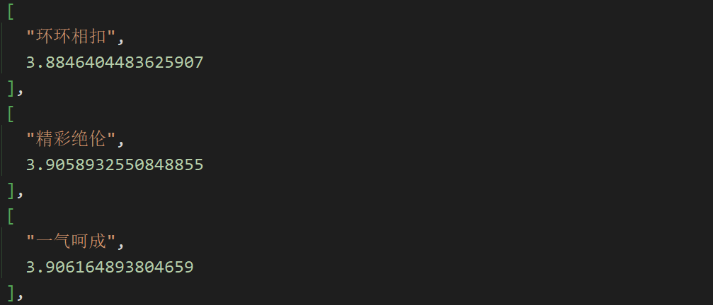
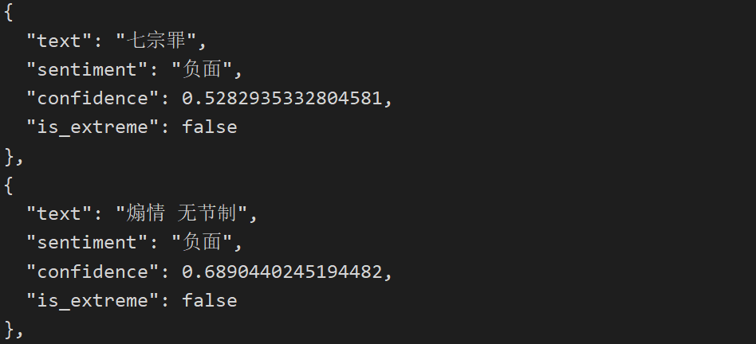
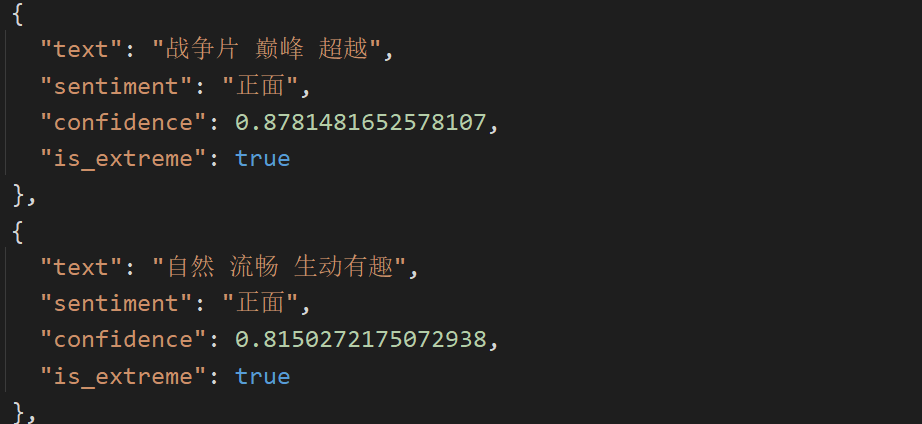
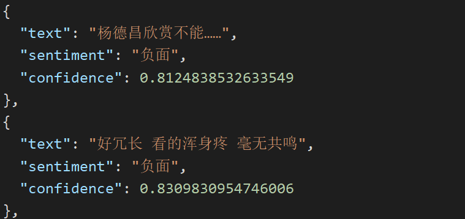

## 我一共训练了4个模型
## 其中一个是基于卷积神经网络的情感分析(CNN)
我使用了豆瓣TOP250电影的所有评论数据来训练模型
这个模型实现了模拟电影评论的情感预测
- 比如：
- 我太喜欢这部电影了(正面)
- 这部电影太差了(负面)
## 另外一个是基于支持向量机的电影类型分析(SVM)
我使用了豆瓣TOP250电影的所有简介数据来训练模型
这个模型实现了模拟电影简介的类型预测
- 比如：
- text_id,input_text,predicted_types,top_5_predictions
- 1,美国南北战争前夕，南方农场塔拉庄园的千金斯嘉丽（费雯·丽 Vivien Leigh 饰）爱上了另一个农场主的儿子艾希礼（莱斯利·霍华德 Leslie Howard 饰），遭到了拒绝，为了报复，她嫁给了...,"剧情, 历史, 战争, 爱情",历史: 100.00%; 战争: 99.31%; 剧情: 96.80%; 爱情: 93.20%; 悬疑: 53.04%
- 2,1991年，香港黑帮三合会会员刘健明（刘德华）听从老大韩琛（曾志伟）的吩咐，加入警察部队成为黑帮卧底，韩琛许诺刘健明会帮其在七年后晋升为见习督察。1992年，警察训练学校优秀学员陈永仁（梁朝伟）被上级...,"剧情, 悬疑, 爱情, 犯罪",悬疑: 100.00%; 剧情: 98.69%; 犯罪: 97.66%; 爱情: 60.63%; 纪录片: 29.83%
## 其余两个是基于朴素贝叶斯(Bayes)和支持向量机(SVM)的电影评论综合分析
我使用了豆瓣TOP250电影的所有评论数据来训练模型
这两个模型得到了：
- 1.所有影响评论情感的关键词语
  
- 2.所有的正面评论词与负面评论词
  
- 3.所有极端评论词(包括正面与负面)
  
- 4.模拟电影评论的情感预测
  